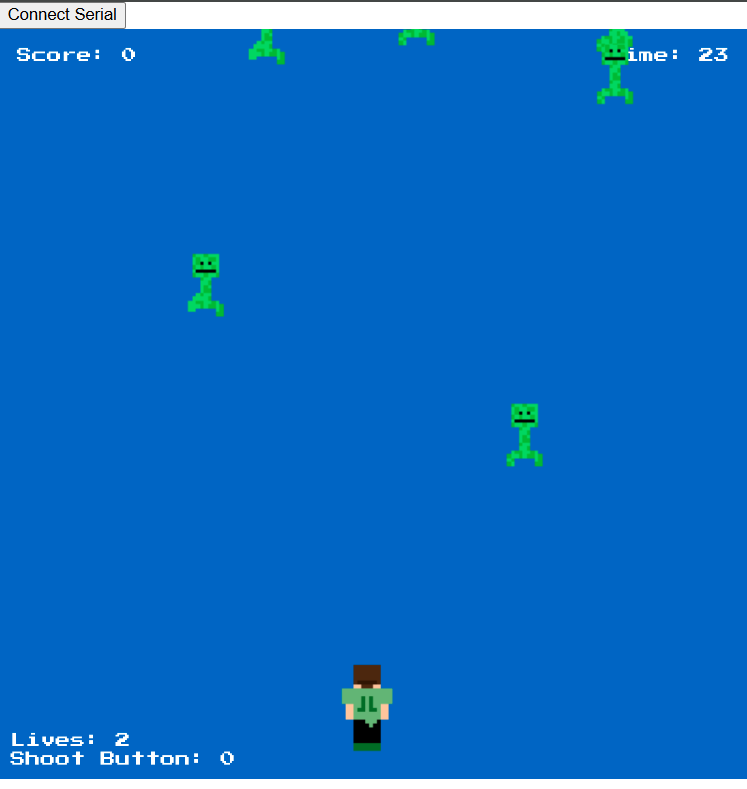

# Zombie Shooter

Zombie Shooter is a game in which the goal is for the player to survive a zombie invasion by shooting falling zombies using a player-controlled shooter that moves left and right. The player wins by shooting down enough zombies before running out of lives.

## Outline

- [Objects](#objects)  
  - [Player](#player)  
  - [Bullet](#bullet)  
  - [Zombies](#zombies)  
- [Mechanics](#mechanics)  
  - [Score](#score)  
  - [Lives](#lives)  
  - [Win and Loss Conditions](#win-and-loss-conditions)  
- [Components](#components)  
  - [Graphics](#graphics)  
  - [Sound](#sound)  
  - [Hardware](#hardware)  
- [Future Development](#future-development)  
- [Video](#video)

## Objects

### Player

The player is represented by a rectangle at the bottom of the screen. The player can move left and right using the **arrow keys** on the keyboard. Pressing the **space bar** shoots a bullet upward. The player's job is to shoot zombies before they reach the bottom.

### Bullet

Bullets are black arrows that shoot upward when the player presses the space bar. A bullet can only destroy one zombie at a time and disappears after hitting a zombie or leaving the top of the screen.

### Zombies

Zombies are represented as sprites I created that resemble a creeper from Minecraft that fall from the top of the screen at a steady pace. If a zombie is hit by a bullet, it disappears and the player's score increases. If a zombie reaches the bottom of the screen, the player loses a life.

## Mechanics

### Score

Each time the player successfully hits a zombie with a bullet, the score increases by 1. The player wins when they reach a target score (e.g., 15 zombies shot).

### Lives

The player starts with 3 lives. Each time a zombie reaches the bottom of the screen, one life is lost. When all 3 lives are gone, the game ends.

### Win and Loss Conditions

- **Win**: The player wins the game by shooting a target number of zombies (e.g., 15).
- **Lose**: The player loses if all lives are lost before reaching the target score.

## Components

### Graphics

Graphics are simple 2D shapes:
- Player: a rectangle
- Zombies: rectangles
- Bullets: thin vertical rectangles
- Background: black or dark-colored for contrast

### Sound

Three sound effects are included:
- Shooting a bullet
- Hitting a zombie
- Losing a life

These are implemented using **Tone.js** or the browser's built-in sound support.

### Hardware

The game runs in a browser using **p5.js**, with keyboard controls:
- Left/right arrows for movement
- Space bar to shoot

Although the original version included joystick and Arduino-controlled LEDs, this version relies solely on keyboard input and has no external hardware requirements.

## Future Development

Several enhancements could be added in future versions:
- Multiple zombie types with varying speed
- Power-ups like rapid fire or multi-shot
- Difficulty scaling over time
- Soundtrack music for immersion
- Animated graphics for better visuals
- Re-integration of Arduino LEDs to represent remaining lives

## Video

[Video of game](recording.mp4)
